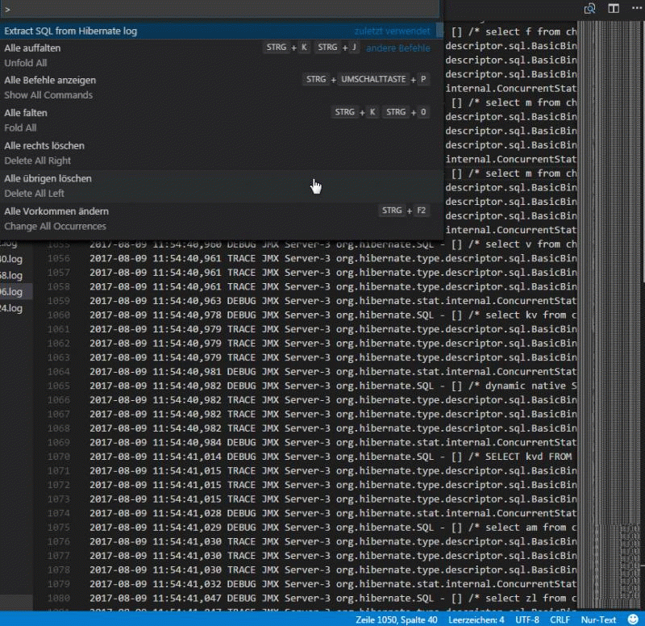

# Hibernate LOG analyser

Debug von raw SQL generated by Hibernate.  
Reintegrate the bind values for debug querys directly to an SQL Console.  
Find where in code a query was fired, by using debug log entrys.  

## Usage

A dialog box is shown by pressing `Ctrl + Alt + P` search for command `Extract SQL from Hibernate log`.  
Or by pressing `Alt + C E` keys (press <kbd>E</kbd> after release <kbd>Alt</kbd> and <kbd>C</kbd>)  
It will parse the current open hibernate log file and show the raw sql in new editor.  

## Debug markers in code

You can put debug marker in your code.

    LOG.error("#### my debug info");

Those have to start with at least 4 #. do be shown in the output.

## Setup

Activate hibernate logging in log4j.xml

     &lt;logger name="org.hibernate.type"&gt;
        &lt;level value="trace&gt;
     &lt;/logger&gt;
     &lt;logger name="org.hibernate.SQL"&gt;
        &lt;level value="trace"/&gt;
     &lt;/logger&gt;

Force hibernate to log querys:

     configurationRegistry.setProperty("hibernate.show_sql", "true");

Further informations can be found at: &quot;[Hibernate show real SQL](https://stackoverflow.com/questions/2536829/hibernate-show-real-sql)&quot;  
I would advice to use additionaly this extension [Monitor file](https://marketplace.visualstudio.com/items?itemName=rkostrzewski.monitor-file) to monitor log files for changes.
